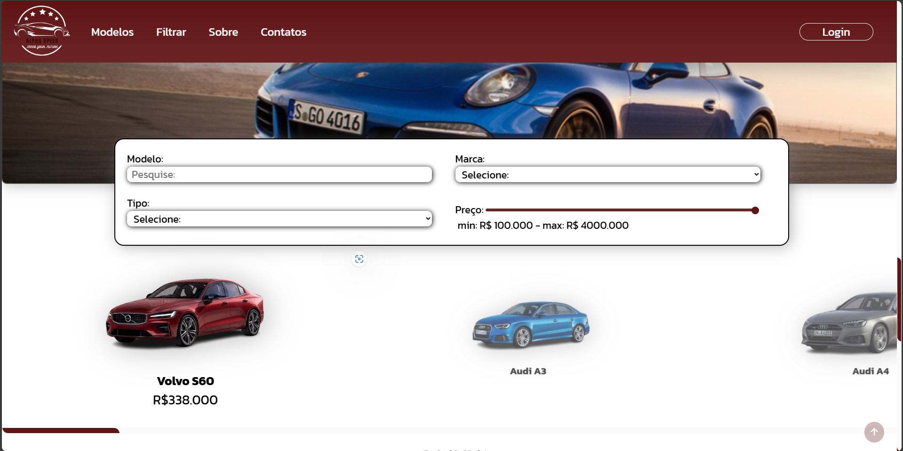

# Alpha Speed

Este é um projeto de um site para uma concessionária de veículos desenvolvido como parte de um curso. O site possui um mostruário dinâmico de veículos, filtros de busca e um sistema de login utilizando Local Storage.



## Índice

-   <a href="#%EF%B8%8F-tecnologias-utilizadas">Tecnologias Utilizadas</a>
-   <a href="#-funcionalidades">Funcionalidades</a>
-   <a href="#-estrutura-do-projeto">Estrutura do Projeto</a>
-   <a href="#-como-executar-o-projeto">Como Executar o Projeto</a>
-   <a href="#-conclusão">Conclusão</a>
-   <a href="#-contato">Contato</a>

## 🛠️ Tecnologias Utilizadas

**HTML**: Utilizado para a estruturação das páginas.  
**CSS (em módulos)**: Utilizado para a estilização das páginas e para tornar o site responsivo.  
**JavaScript**: Utilizado para adicionar interatividade ao site, incluindo o sistema de login, os filtros de busca e o mostruário dinâmico de veículos.

## 🚀 Funcionalidades

Algumas das funcionalidades desse projeto são:

### 📋 Mostruário de Veículos

O site apresenta um mostruário dinâmico de veículos, onde os dados dos veículos são armazenados em um array e exibidos utilizando a função `map` do JavaScript. Cada veículo é apresentado com suas informações principais, como modelo, marca e preço ao passar o mouse por cima.

### 🔍 Filtros de Busca

Os filtros permitem que os usuários busquem por veículos específicos com base em critérios como marca, modelo, tipo e faixa de preço. Os filtros são aplicados em tempo real, atualizando o mostruário do filtro conforme o usuário ajusta as opções.

### 🔑 Login com Local Storage

O site inclui um sistema de login que utiliza o Local Storage do navegador para armazenar as informações de login do usuário. Ao fazer login, as informações do usuário são salvas localmente, permitindo que o site reconheça o usuário em visitas futuras sem a necessidade de um banco de dados.

## 📁 Estrutura do Projeto

-   **index.html**: Página inicial que contém o mostruário de veículos e os filtros de busca.

### assets

-   **html**

    -   **login.html**: Página de login para os usuários.
    -   **cadastrar.html**: Página de cadastro para os novos usuários.

-   **css**

    -   **modules**: Pasta contendo os módulos CSS para estilização específica de componentes do site.
    -   **styles.css**: Arquivo CSS principal que centraliza a estilização geral do site.

-   **js**
    -   **scripts.js**: Arquivo JavaScript contendo a lógica para o mostruário dinâmico, filtros de busca e sistema de login.

## 📝 Como Executar o Projeto

1. Clone este repositório em sua máquina local:

    ```bash
    git clone https://github.com/lucasatdriano/alphaSpeed
    ```

2. Navegue até o diretório do projeto:

    ```bash
    cd alphaSpeed
    ```

3. Abra o arquivo `index.html` em seu navegador:
    ```bash
    open index.html  # Para macOS
    # ou
    start index.html  # Para Windows
    # ou
    xdg-open index.html  # Para Linux
    ```

## 🎓 Conclusão

Este projeto demonstra a utilização de HTML, CSS e JavaScript para criar um site funcional para uma concessionária de veículos. A inclusão de um mostruário dinâmico, filtros de busca e um sistema de login utilizando Local Storage mostra como essas tecnologias podem ser utilizadas para criar uma experiência de usuário dinâmica e interativa.

## 📞 Contato

Este projeto foi desenvolvido por mim, Lucas Adriano, como parte de um curso em desenvolvimento de sistemas. Entre em contato em caso de dúvidas ou sugestões.

-   **Email**: [lucasatdriano@gmail.com](mailto:lucasatdriano@gmail.com)
-   **LinkedIn**: [Lucas Adriano](https://linkedin.com/in/lucas-adriano-037003278/)
-   **Instagram**: [@\_\_lgoncalves](https://instagram.com/__lgoncalves/)
